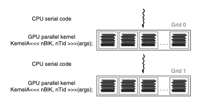
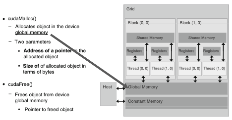
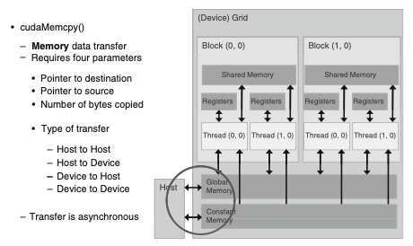
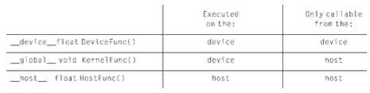
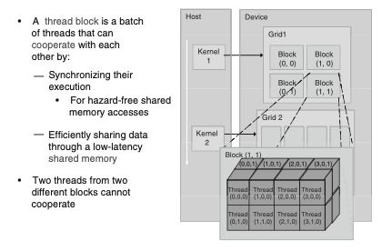

<span style = "font-family: 'JetBrains Mono', monospace; font-size: 12">

## Programming Massively Parallel Processors
### CH1: Introduction
* multicore CPUs: maximize execution speed of sequential programs
* many-core GPUs: execution throughput of parallel applications

* **large** performance gap between parallel and sequential execution

Why?:

* developers move computationally intensive parts of software to GPUs

* design of a CPU is optimized for sequential code performance

* memory bandwidth is another issue. GPUs move data much faster in and out of its DRAM.

* video games require massive number of floating point calculations per video frame, being executed parallely and GPUs have been used for this purpose.

#### CUDA (Compute Unified Device Architecture)
* programming model created by NVIDIA to support joint CPU/GPU execution of an application.

* CUDA capable GPU is organized into array of highly threaded streaming multiprocessor(SMs). SMs combine to form a building block. SMs have a number of streaming processors (SPs) that share control logic and isntruction cache.

 

* To experience speedup offered by parallelization, a large part of the application's execution time must be in the parallel portion.

* Certain applications have portions better suited to CPUs and hence a combined CPU/GPU parallel computing capability is required. This is precisely what CUDA promotes.

* Key Steps in Parallel Computing: 
    * identifying parts of application programs to be parallelized
    * isolating the data to be used by the parallelizing code by using API function to allocate memory on the parallel computing device
    * using API function to transfer data to parallel computing device
    * developing kernel function that will be executed by individual threads in parallel part
    * launching kernel function for execution by parallel parts
    * transfering data back to host processor with API function call

-----
###  CH2: History of GPU Computing
#### GPGPU
General Purpose Computing on GPUs.
* GPU processor array and frame buffer memory were designed to process graphics data and were too restrictive for general numerical applications.
* writes were extremely difficult -> could only be emitted as a pixel color value and  configure the frame buffer  operation to write.
* the handful of useful applications created with general computations on a GPU -> this field was called GPGPU.

#### GPU Computing
* NVIDIA developed Tesla GPU Architecture.
* programming paradigm to think of GPU like a processor.
* programming approach involved explicit declaration of data-parallel aspects of their workload. 
* no longer need to use graphics API to access parallel computing capabilities 

-----
### CH3: Introduction to CUDA

#### Data Parallelism
* computing system consists of host (CPU) & devices (massively parallel processors)
* CUDA devices accelerate execution of applications by harvesting a large amount of data parallelism.
* Matrix Multiplication P = M X N :
    * As every entry $p_{ij}$ is independent of each other, large amount of data parallelism can be performed.
#### CUDA Program Structure
* CUDA program comprises of phases that are executed either by the host (CPU) or a device such as a GPU.
* CUDA Program is a unified source code comprising both host & device code.
    * NVIDIA C compiler = (nvcc): host code = ANSI C; device code = ANSI C extended with keywords for data parallel functions, called kernels.
    * kernel functions generate a large number of threads to exploit data parallelism.
    * when no device available, one can execute the kernel on a CPU using the CUDA SDK or MCUDA tool.
* CUDA threads are faster to generate and schedule than CPU threads due to efficient hardware support.

 

* CUDA Program:
    * starts with CPU execution, when kernel function is invoked, execution is moved to device.
    * large no. of threads are generated to take advantage of data parallelism, collectively called *grids* 
    * when all threads finish execution, corresponding grid is terminated and execution moves back to host.

#### MATMUL Example

```
int main (void) {
1.  // Allocate and initialize matrices M, N, P
    // I/O to read input matrices M and N

2.  // M * N on the device
    // MatrixMultiplication(M,N,P,Width);

3.  // I/O to write output matrix P
    // Free matrices M,N, P

    return 0;
}
```
* For a device based implementaion of MatrixMultiplication(), we implement the following:
    * Part 1: device memory allocation for M, N, P & memcpy to correct locations
    * Part 2: invoke a CUDA kernel that launches parallel execution of matrix multiplication onto device
    * Part 3: copy product matrix P from device memory back to host memory
* revised MatrixMultiplication() is essentially an outsourcing agent that ships input data to device
* it then activates the calculation on the device & collects results from device onto the host

```
void MatrixMultiplication(float *M, float *N, float *P, int Width) {
    int size = Width * Width * sizeof(float);
    float *Md, Nd, Pd;

1.  // Allocate device memory for M, N, P
    // copy M and N to allocated device memory locations 

2.  // Kernel invocation code - to have device to perform 
    // Matrix Multiplication 

3.  // copy P from device memory
    // Free device matrices M,N,P

    return 0;

}
```
#### Device Memory & Data Transfer

 

* CUDA runtime system provides API functions to perform memory allocation and transfer of data between host and devices.
* CUDA devices comprise of global memory and constant memory. These are the memories to which the host code can perform read/write to.
* Constant memory has read-only access by the device code.
* API functions cudaMalloc() and cudaFree() can be used to allocate and deallocate global memory.
* API function cudaMemcpy() can be used for data transfer between host & device memory.

 

For cudaMalloc(): 1st parameter is a generic pointer value (void **) as memory allocation function is a generic function that is not restricted to any particular type of object. 2nd Parameter of cudaMalloc() is the size of the object to be allocated in bytes.

Example use of cudaMalloc:
```
float *Md
int size = Width * Width * sizeof(float);
cudaMalloc((void**)&Md, size);
. . .
cudaFree(Md);
```
For cudaMemcpy(): 1st parameter is pointer to destination location, 2nd parameter points to source data object to be copied. 
3rd parameter is number of bytes to be copied and 4th parameter indicates types of memory involved in copy (h to d, d to h, d to d).

Note: cudaMemCpy cannot be used for memory transfer in a multi-GPU system.




Example use of cudaMemcpy:
```
cudaMemcpy(Md, M, size, cudaMemcpyHostToDevice);
cudaMemcpy(P, Pd, size, cudaMemcpyDeviceToHost);
```

In the MatMul example, the main function calls MatrixMultiplication(), which is also executed on the host.
MatrixMultiplication() allocates device memory & performs data transfers and activates the kernel that actually performs matrix multiplication.
This type of host code is referred to as *stub function*.

```
void MatrixMultiplication(float *M, float *N, float *P, int Width) {
    int size = Width * Width * sizeof(float);
    float *Md, Nd, Pd;

1.  // Allocate device memory for M, N, P
    // copy M and N to allocated device memory locations 
    cudaMalloc((void **) &Md, size);
    cudaMemcpy(Md, M, size, cudaMemcpyHostToDevice);
    cudaMalloc((void **) &Nd, size);
    cudaMemcpy(Nd, N, size, cudaMemcpyHostToDevice);
    cudaMalloc((void **) &Pd, size);

2.  // Kernel invocation code - to have device to perform 
    // Matrix Multiplication 
    ...

3.  // copy P from device memory
    cudaMemcpy(P, Pd, size, cudaMemcpyDeviceToHost);
    // Free device matrices M,N,P
    cudaFree(Md); cudaFree(Nd); cudaFree(Pd);
}
```
#### Kernel Functions and Threading

In CUDA, Kernel function specifies the code to be executed by all threads during a parallel phase.
Since all threads execute the same code, CUDA programmming is an instance of single program, multiple data (SPMD) parallel-programming style.

CUDA-specific keywords:



Note: device functions can not have recursive function calls nor indirect function calls through pointers in them.

Note: both host and device can be used in a function declaration which triggers the compilation system to generate two versions of same function.

Keywords threadIdx.x and threadIdx.y can be used to refer to thread indices of a thread. These keywords identify predefined varaibles that allow a thread to access hardware registers at runtime that provide the indetifying coordinates to the thread.

Notation of thread: $thread_{threadIdx.x, threadIdx.y}$

* Threads in a grid are organized into a two level hierarchy:
    * at the top level, each grid comprises of one or more blocks
    * each block has a unique two dimesional coordinate x & y
* All threads must have the same number of threads organized in the same manner.



* Each thread block is organized as a 3D array of threads with a total size of up to 512 threads with coordinates defined by threadIdx.x, threadIdx.y, threadIdx.z
* When host code invokes kernel, it sets grid and thread block dimensions via execution configuration parameters. Two struct variables of type dim3: dimBlock & dimGrid are declared to specify configurations of grid and that of block. 

Example Code:
```
// Setup execution configuration
dim3 dimBlock(Width, Width);
dim3 dimGrid(1, 1);

// Launch device computation threads!
MatrixMulKernel<<<dimGrid, dimBlock>>>(Md, Nd, Pd, Width);
```
---
### CH4: CUDA Threads


</span>
