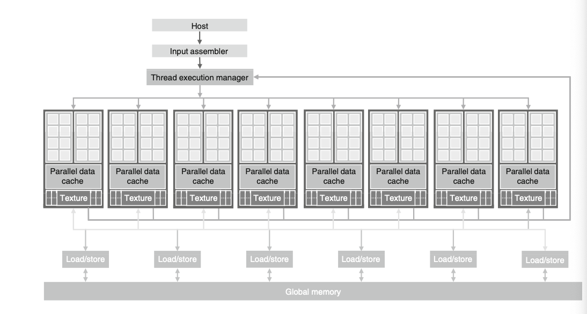

* multicore CPUs: maximize execution speed of sequential programs
* many-core GPUs: execution throughput of parallel applications

> large performance gap between parallel and sequential execution

Why?:
> developers move computationally intensive parts of software to GPUs

> design of a CPU is optimized for sequential code performance

> memory bandwidth is another issue. GPUs move data much faster in and out of its DRAM.

> video games require massive number of floating point calculations per video frame, being executed parallely and GPUs have been used for this purpose.

#### CUDA (Compute Unified Device Architecture)
* programming model created by NVIDIA to support joint CPU/GPU execution of an application.

* CUDA capable GPU is organized into array of highly threaded streaming multiprocessor(SMs). SMs combine to form a building block. SMs have a number of streaming processors (SPs) that share control logic and isntruction cache.
 

* To experience speedup offered by parallelization, a large part of the application's execution time must be in the parallel portion.

* Certain applications have portions better suited to CPUs and hence a combined CPU/GPU parallel computing capability is required. This is precisely what CUDA promotes.

* Key Steps in Parallel Computing: 
    * identifying parts of application programs to be parallelized
    * isolating the data to be used by the parallelizing code by using API function to allocate memory on the parallel computing device
    * using API function to transfer data to parallel computing device
    * developing kernel function that will be executed by individual threads in parallel part
    * launching kernel function for execution by parallel parts
    * transfering data back to host processor with API function call

    -----
#### GPGPU
General Purpose Computing on GPUs.
* GPU processor array and frame buffer memory were designed to process graphics data and were too restrictive for general numerical applications.
* writes were extremely difficult -> could only be emitted as a pixel color value and  configure the frame buffer  operation to write.
* the handful of useful applications created with general computations on a GPU -> this field was called GPGPU.

#### GPU Computing
* NVIDIA developed Tesla GPU Architecture.
* programming paradigm to think of GPU like a processor.
* programming approach involved explicit declaration of data-parallel aspects of their workload. 
* no longer need to use graphics API to access parallel computing capabilities 

-----
#### Data Parallelism
* computing system consists of host (CPU) & devices (massively parallel processors)
* CUDA devices accelerate execution of applications by harvesting a large amount of data parallelism.
* Matrix Multiplication P = M X N :
    * As every entry $p_{ij}$ is independent of each other, large amount of data parallelism can be performed.
#### CUDA Program Structure
* CUDA program comprises of phases that are executed either by the host (CPU) or a device such as a GPU.
* CUDA Program is a unified source code comprising both host & device code.
    * NVIDIA C compiler = (nvcc): host code = ANSI C; device code = ANSI C extended with keywords for data parallel functions, called kernels.
    * kernel functions generate a large number of threads to exploit data parallelism.
